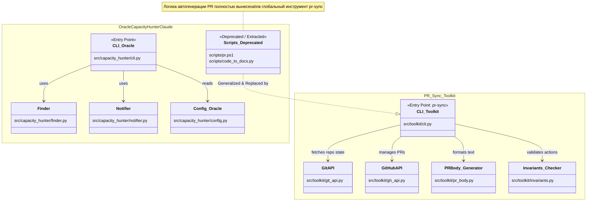

# Анализ и Архитектура `pr-sync` (SDD Analyze Report)

## 1. Ретроспектива и риски LLM
Проект `pr-sync` достиг версии MVP (v1.0.0). Базовый функционал автогенерации PR из коммитов реализован и протестирован (21/21).

**Риски LLM-генерации (v1.1+):**
- **Идемпотентность:** Повторный вызов генерации перезапишет ручные правки в PR.
- **Недетерминированность:** Текст может отличаться байт-в-байт при тех же вводных данных.
- **Трата ресурсов:** Настройка генерации PR съела больше времени, чем должна была сэкономить.

**Вывод:** Разработка LLM-модуля заморожена. Фокус смещен на эксплуатацию инструмента `pr-sync` в том виде, в каком он есть сейчас.

## 2. Архитектура интеграции: `pr-sync` и `oracle-capacity-hunter-claude`

Ниже представлена диаграмма, описывающая структуру проектов и то, как `pr-sync` выступает генерализированным модулем.

