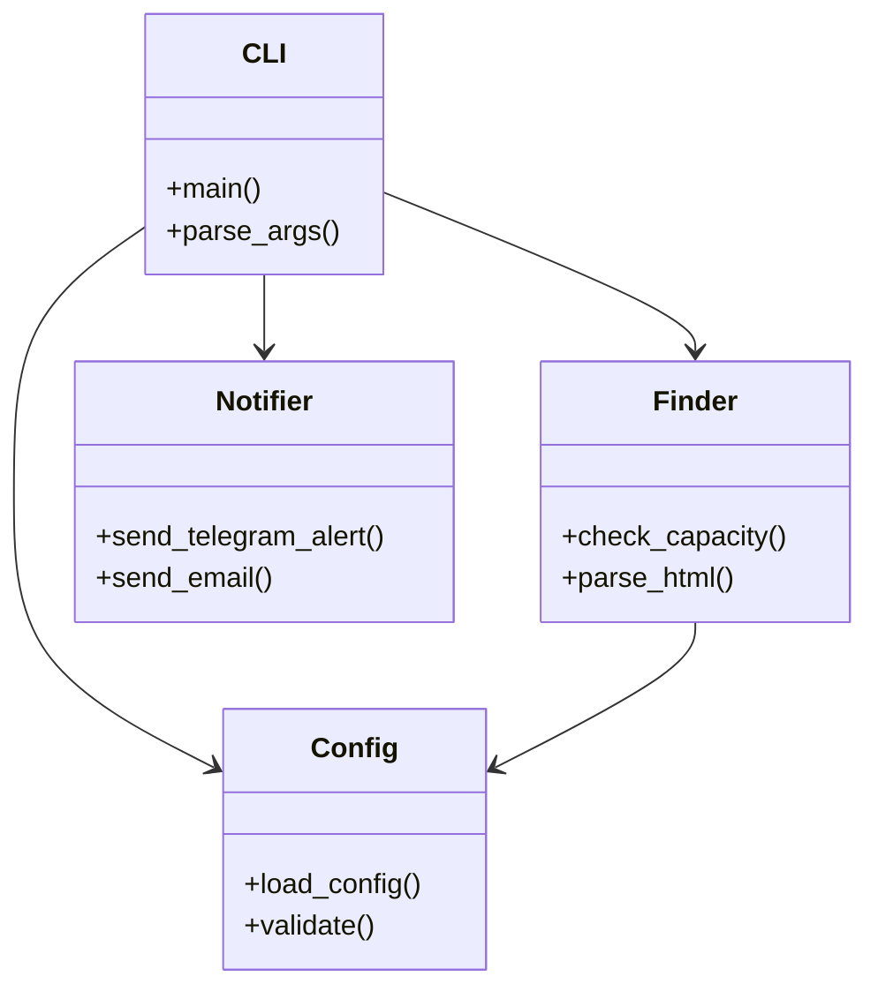
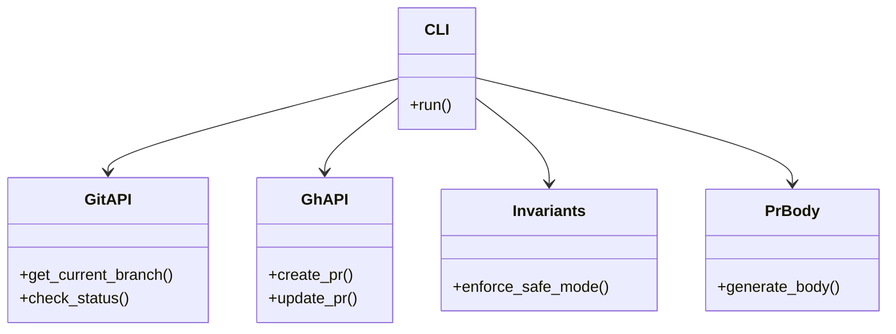
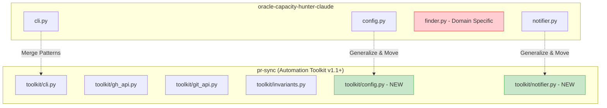

# Architecture & Generalization Plan

## 1. Current Structure: oracle-capacity-hunter-claude

```mermaid
classDiagram
    class CLI {
        +main()
        +parse_args()
    }
    class Config {
        +load_config()
        +validate()
    }
    class Finder {
        +check_capacity()
        +parse_html()
    }
    class Notifier {
        +send_telegram_alert()
        +send_email()
    }
    
    CLI --> Config
    CLI --> Finder
    CLI --> Notifier
    Finder --> Config
```

## 2. Current Structure: pr-sync (Automation Toolkit)

```mermaid
classDiagram
    class CLI {
        +run()
    }
    class GitAPI {
        +get_current_branch()
        +check_status()
    }
    class GhAPI {
        +create_pr()
        +update_pr()
    }
    class Invariants {
        +enforce_safe_mode()
    }
    class PrBody {
        +generate_body()
    }
    
    CLI --> GitAPI
    CLI --> GhAPI
    CLI --> Invariants
    CLI --> PrBody
```

## 3. Generalization Mapping (Target State)

```mermaid
graph TD
    subgraph "oracle-capacity-hunter-claude"
        O_CLI[cli.py]
        O_CFG[config.py]
        O_FIND[finder.py - Domain Specific]
        O_NOT[notifier.py]
    end

    subgraph "pr-sync (Automation Toolkit v1.1+)"
        T_CLI[toolkit/cli.py]
        T_GH[toolkit/gh_api.py]
        T_GIT[toolkit/git_api.py]
        T_INV[toolkit/invariants.py]
        
        T_CFG[toolkit/config.py - NEW]
        T_NOT[toolkit/notifier.py - NEW]
    end
    
    O_CFG -.->|Generalize & Move| T_CFG
    O_NOT -.->|Generalize & Move| T_NOT
    O_CLI -.->|Merge Patterns| T_CLI
    
    style O_FIND fill:#ffcdd2,stroke:#f44336
    style T_CFG fill:#c8e6c9,stroke:#4caf50
    style T_NOT fill:#c8e6c9,stroke:#4caf50
```
