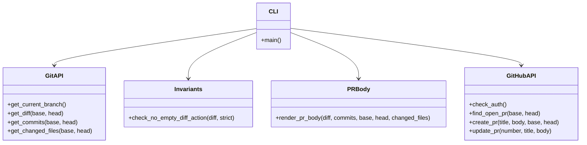

# Архитектура Automation Toolkit (pr-sync)

## 1. Общая архитектура и компоненты

```mermaid
flowchart LR
    subgraph DevEnvironment["Dev Environment (Windows + IDE)"]
        IDE[IDE]
        AgentCLI[Antigravity / AI Agent]
    end

    subgraph AutomationToolkit["Automation Toolkit"]
        Constitution[prepared_docs/constitution.md]
        Spec[specs/001-automation-toolkit/spec.md]
        
        subgraph PRSync["pr-sync package"]
            CLI[toolkit.cli]
            GitAPI[toolkit.git_api]
            GHAPI[toolkit.gh_api]
            PRBody[toolkit.pr_body]
            Invariants[toolkit.invariants]
            LLMAPI[toolkit.llm_api (v1.1+)]
        end
    end

    subgraph Repo["Target GitHub Repo"]
        Git[git repo]
        GH[GitHub (gh CLI)]
        PR[Pull Request]
    end

    IDE --> CLI

    CLI --> GitAPI
    CLI --> GHAPI
    CLI --> Invariants
    CLI --> PRBody

    GitAPI --> Git
    GHAPI --> GH

    PRBody --> PR

    Constitution --> Spec
    Spec --> PRSync

    LLMAPI -.->|v1.1+| PRBody
```

## 2. Структура классов и модулей


