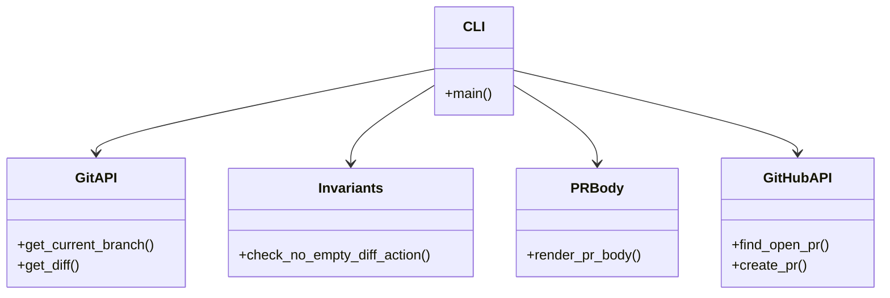
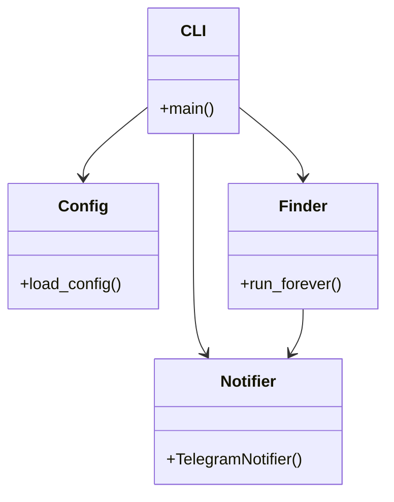

# Automation Toolkit Architecture

## pr-sync (v1.0.0)

*Note: `pr-sync` relies entirely on determinism. The `pr_body` module uses static templating. The `toolkit/` layer is designed to be shared with future tools (e.g., `release-sync`).*

## Cross-Repository Analysis: oracle-capacity-hunter-claude

*Conclusion: The Oracle bot interacts strictly with OCI and Telegram. There is no PR generation logic (`codetodocs.py`) to extract. LLM-based PR generation for `pr-sync` must be designed as a net-new feature.*
